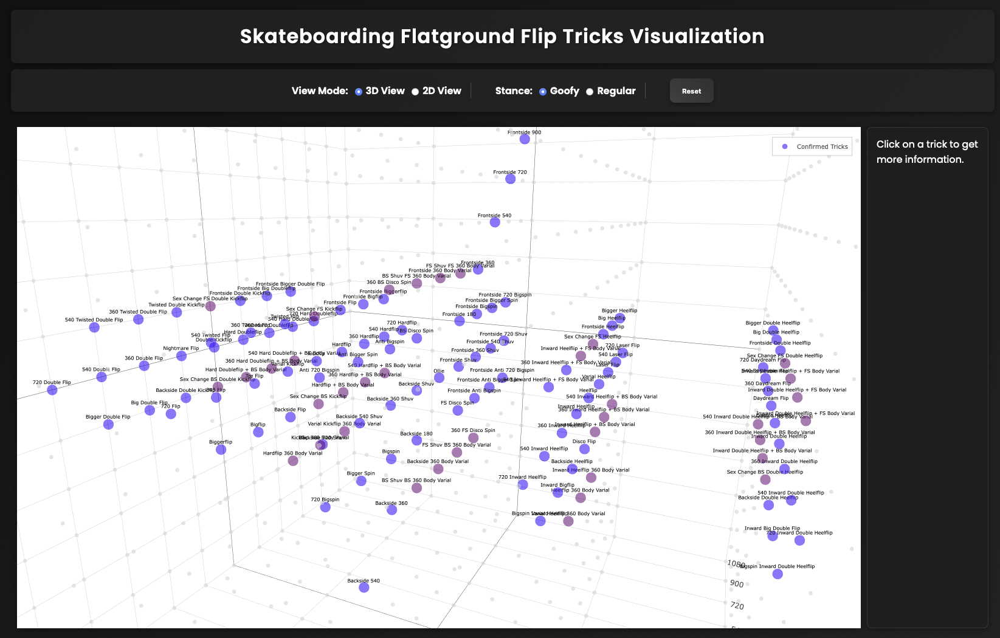
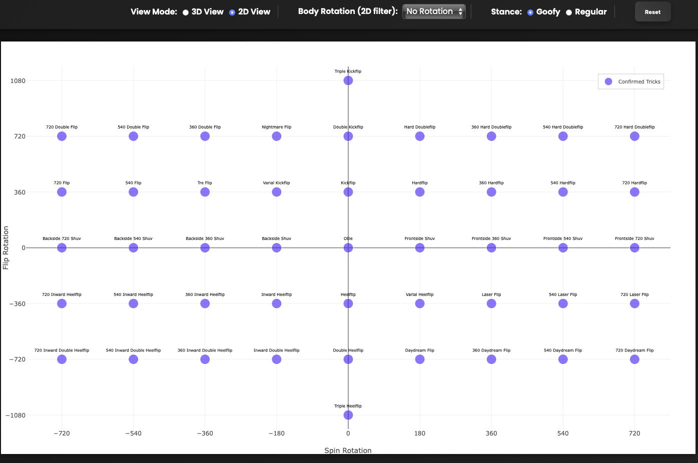

# Skateboarding Flip Trick Visualizer
Visualize all possible flatground flip trick combinations in 3D space

No late-flips, half-flips, wraps, underflips, forward flips, pressure flips, and rewinds. Just the basics.

Demo: https://nathanreeves.github.io/flip-trick-visualizer/



## Testing Trick Catalog
```bash
python3 test_catalog.py
```

## Running plotly.js locally 
Run http server at http://localhost:8000 so we can access trick_names.csv
```bash
python3 -m http.server 8000
```